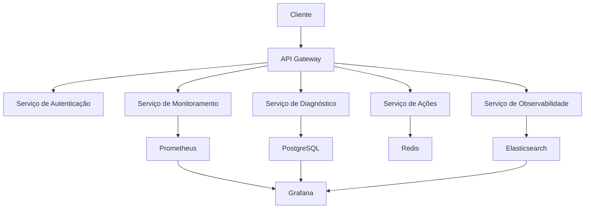

# Guia de Arquitetura

## Visão Geral

O Sistema de Autocura Cognitiva é construído seguindo uma arquitetura modular e distribuída, com foco em escalabilidade, resiliência e manutenibilidade.

## Arquitetura do Sistema

### Componentes Principais

1. **API Gateway**
   - Gerenciamento de requisições
   - Autenticação e autorização
   - Rate limiting
   - Cache

2. **Serviços Core**
   - Monitoramento
   - Diagnóstico
   - Ações
   - Observabilidade

3. **Armazenamento**
   - PostgreSQL (dados estruturados)
   - Redis (cache e filas)
   - Elasticsearch (logs e métricas)

4. **Infraestrutura**
   - Docker
   - Kubernetes
   - Prometheus
   - Grafana

### Diagrama de Arquitetura



## Padrões de Design

### 1. Microserviços

- Cada serviço é independente
- Comunicação via API REST/gRPC
- Escala independente
- Falhas isoladas

### 2. Event-Driven

- Eventos assíncronos
- Pub/Sub com Redis
- Processamento em background
- Resiliência a falhas

### 3. CQRS

- Separação de leitura/escrita
- Otimização de consultas
- Cache inteligente
- Escalabilidade horizontal

## Tecnologias

### Backend

- **Framework**: FastAPI
- **Linguagem**: Python 3.8+
- **ORM**: SQLAlchemy
- **Cache**: Redis
- **Fila**: Celery

### Frontend

- **Framework**: React
- **Estado**: Redux
- **Estilo**: Tailwind CSS
- **Gráficos**: D3.js

### Infraestrutura

- **Container**: Docker
- **Orquestração**: Kubernetes
- **Monitoramento**: Prometheus
- **Visualização**: Grafana
- **Logs**: ELK Stack

## Segurança

### Autenticação

- JWT (JSON Web Tokens)
- OAuth 2.0
- MFA (Multi-Factor Authentication)
- Rate Limiting

### Autorização

- RBAC (Role-Based Access Control)
- ACL (Access Control Lists)
- Políticas granulares
- Auditoria de acesso

### Criptografia

- TLS 1.3
- AES-256
- Chaves assimétricas
- Certificados digitais

## Escalabilidade

### Horizontal

- Sharding de banco de dados
- Balanceamento de carga
- Cache distribuído
- Filas de mensagens

### Vertical

- Otimização de consultas
- Índices eficientes
- Particionamento de dados
- Compressão

## Resiliência

### Tolerância a Falhas

- Circuit breakers
- Retry policies
- Fallbacks
- Timeouts

### Recuperação

- Backup automático
- Replicação de dados
- Failover automático
- Disaster recovery

## Monitoramento

### Métricas

- Performance
- Disponibilidade
- Erros
- Latência

### Alertas

- Thresholds dinâmicos
- Agregação inteligente
- Escalonamento
- Silêncio programado

## Logs

### Estrutura

```json
{
    "timestamp": "2024-05-02T12:00:00Z",
    "level": "INFO",
    "service": "monitoramento",
    "trace_id": "abc123",
    "message": "Métrica coletada",
    "metadata": {
        "metric": "cpu_usage",
        "value": 75.5,
        "host": "server-01"
    }
}
```

### Agregação

- Centralização
- Indexação
- Retenção
- Análise

## Desenvolvimento

### CI/CD

- Git Flow
- Testes automatizados
- Deploy contínuo
- Rollback automático

### Qualidade

- Linting
- Formatação
- Testes unitários
- Testes de integração

## Manutenção

### Documentação

- Swagger/OpenAPI
- Diagramas
- Guias
- Exemplos

### Suporte

- Monitoramento proativo
- Logs detalhados
- Métricas de saúde
- Alertas inteligentes

## Evolução

### Roadmap

1. **Fase 1**: MVP
   - Monitoramento básico
   - Diagnóstico simples
   - Ações manuais

2. **Fase 2**: Automação
   - Diagnóstico avançado
   - Ações automáticas
   - Machine Learning

3. **Fase 3**: Inteligência
   - Previsão de falhas
   - Otimização automática
   - Auto-healing

### Considerações

- Compatibilidade retroativa
- Migração de dados
- Treinamento
- Feedback contínuo 