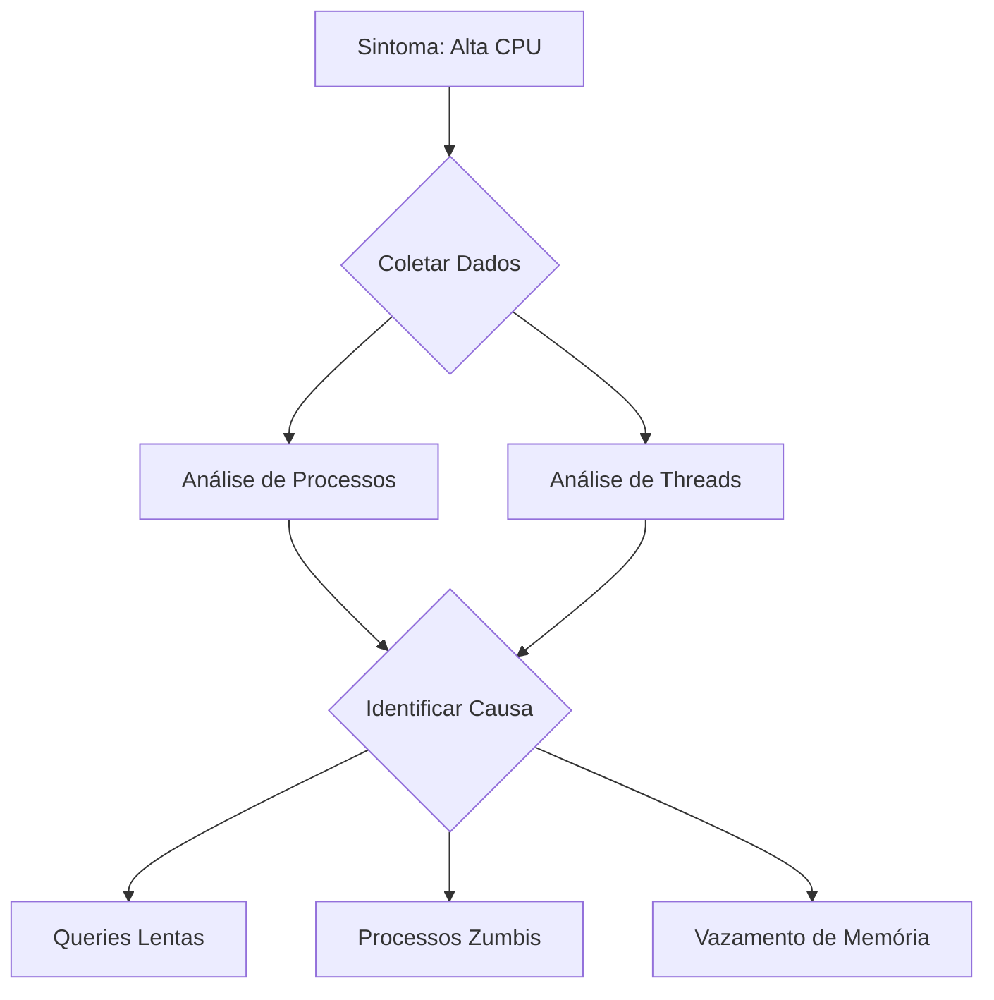

# Guia de Diagnóstico

## Visão Geral

Este guia descreve os processos e ferramentas de diagnóstico do Sistema de Autocura Cognitiva.

## Processo de Diagnóstico

### 1. Coleta de Dados

#### Métricas
- Performance
- Erros
- Logs
- Traces

#### Ferramentas
```bash
# Coletar métricas
curl http://localhost:9090/metrics

# Verificar logs
tail -f /var/log/autocura/app.log

# Analisar traces
jaeger-cli query --service=autocura
```

### 2. Análise

#### Padrões
- Correlação temporal
- Causalidade
- Impacto
- Frequência

#### Exemplos
```python
def analyze_patterns(metrics):
    """
    Analisa padrões em métricas do sistema.
    
    Args:
        metrics: Lista de métricas coletadas
        
    Returns:
        dict: Padrões identificados
    """
    patterns = {
        'correlation': find_correlations(metrics),
        'causality': find_causality(metrics),
        'impact': calculate_impact(metrics),
        'frequency': calculate_frequency(metrics)
    }
    return patterns
```

### 3. Diagnóstico

#### Árvore de Decisão
1. Identificar sintoma
2. Coletar dados relevantes
3. Analisar padrões
4. Formular hipóteses
5. Testar hipóteses
6. Confirmar diagnóstico

#### Exemplo


## Ferramentas de Diagnóstico

### 1. Análise de Performance

#### CPU
```bash
# Top processos
top -b -n 1

# Perfil de CPU
perf record -F 99 -p <PID>
perf report

# Flame graph
./FlameGraph/flamegraph.pl perf.data > perf.svg
```

#### Memória
```bash
# Uso de memória
free -m

# Vazamentos
valgrind --leak-check=full ./app

# Heap analysis
jmap -heap <PID>
```

### 2. Análise de Rede

#### Conexões
```bash
# Conexões ativas
netstat -anp

# Tráfego
tcpdump -i eth0

# Latência
ping -c 10 example.com
```

#### Performance
```bash
# Throughput
iperf -c server

# Packet loss
mtr example.com

# DNS
dig example.com
```

### 3. Análise de Aplicação

#### Logs
```python
import logging

logging.basicConfig(
    level=logging.DEBUG,
    format='%(asctime)s %(levelname)s %(message)s'
)

logger = logging.getLogger('autocura')
logger.debug('Mensagem de debug')
```

#### Traces
```python
from opentelemetry import trace

tracer = trace.get_tracer(__name__)

with tracer.start_as_current_span("operacao") as span:
    span.set_attribute("parametro", valor)
    # código da operação
```

## Casos de Uso

### 1. Performance Degradada

#### Sintomas
- Alta latência
- Timeouts
- Erros 500
- Queue buildup

#### Diagnóstico
1. Verificar métricas de sistema
2. Analisar logs de erro
3. Identificar gargalos
4. Propor soluções

### 2. Erros Intermitentes

#### Sintomas
- Falhas aleatórias
- Inconsistências
- Comportamento inesperado
- Recovery automático

#### Diagnóstico
1. Coletar logs de erro
2. Analisar padrões temporais
3. Identificar condições
4. Reproduzir cenário

### 3. Vazamento de Recursos

#### Sintomas
- Crescimento de memória
- Aumento de handles
- Degradação gradual
- Falhas por OOM

#### Diagnóstico
1. Monitorar uso de recursos
2. Identificar padrões de crescimento
3. Localizar origem
4. Implementar correção

## Automatização

### 1. Regras de Diagnóstico

#### Configuração
```yaml
rules:
  - name: "High CPU Usage"
    condition: "cpu_usage > 80"
    duration: "5m"
    action: "analyze_processes"
    
  - name: "Memory Leak"
    condition: "memory_growth > 10%"
    duration: "1h"
    action: "analyze_heap"
```

#### Implementação
```python
def apply_diagnostic_rules(metrics):
    """
    Aplica regras de diagnóstico.
    
    Args:
        metrics: Métricas do sistema
        
    Returns:
        list: Diagnósticos encontrados
    """
    diagnostics = []
    for rule in RULES:
        if evaluate_condition(rule['condition'], metrics):
            diagnostic = execute_action(rule['action'], metrics)
            diagnostics.append(diagnostic)
    return diagnostics
```

### 2. Machine Learning

#### Modelos
- Detecção de anomalias
- Predição de falhas
- Classificação de problemas
- Recomendação de ações

#### Implementação
```python
from sklearn.ensemble import IsolationForest

model = IsolationForest(contamination=0.1)
model.fit(training_data)

anomalies = model.predict(test_data)
```

## Documentação

### 1. Casos Conhecidos

#### Estrutura
- Descrição do problema
- Sintomas
- Causa raiz
- Solução
- Prevenção

#### Exemplo
```markdown
## Alta CPU em Queries

### Sintomas
- CPU > 80%
- Queries lentas
- Timeouts

### Causa
- Índices faltantes
- Joins complexos
- Dados não otimizados

### Solução
1. Adicionar índices
2. Otimizar queries
3. Particionar dados

### Prevenção
- Monitoramento de queries
- Revisão de código
- Testes de performance
```

### 2. Playbooks

#### Estrutura
- Procedimento
- Ferramentas
- Comandos
- Verificações

#### Exemplo
```markdown
## Diagnóstico de Performance

### 1. Coleta Inicial
```bash
# CPU
top -b -n 1 > cpu.txt

# Memória
free -m > memory.txt

# Rede
netstat -anp > network.txt
```

### 2. Análise
- Verificar processos
- Analisar conexões
- Identificar gargalos

### 3. Ação
- Documentar achados
- Propor soluções
- Implementar correções
```

## Manutenção

### 1. Atualização

#### Regras
- Revisar periodicamente
- Ajustar thresholds
- Adicionar novos casos
- Remover obsoletos

#### Modelos
- Retreinar periodicamente
- Validar performance
- Ajustar parâmetros
- Documentar mudanças

### 2. Validação

#### Testes
- Casos de uso
- Cenários de falha
- Performance
- Precisão

#### Métricas
- Tempo de diagnóstico
- Precisão
- Falsos positivos
- Falsos negativos 